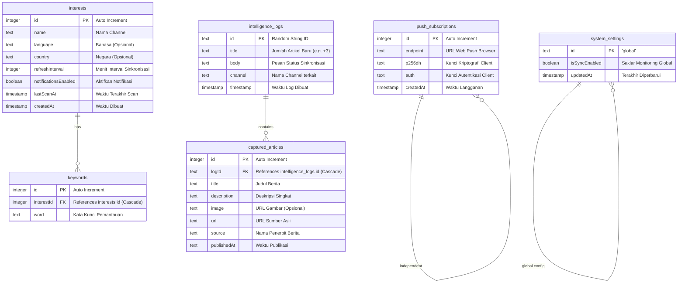

# Analisis Arsitektur dan Fungsionalitas Signalertica

Dokumen ini berisi analisis mendalam tentang struktur codebase, skema database, alur kerja utama, serta rekomendasi pengembangan untuk aplikasi **Signalertica** (pemantau sinyal kata kunci berbasis web).

---

## 1. Ringkasan Aplikasi (Overview)
**Signalertica** adalah aplikasi web real-time yang dirancang untuk melacak dan memantau topik atau kata kunci tertentu (disebut *Surveillance Channels* atau *Interests*). Aplikasi ini mengumpulkan "sinyal" berita dari Google News RSS berdasarkan konfigurasi kata kunci, menyimpannya sebagai log intelijen, dan mengirimkan notifikasi langsung (*Web Push Notifications*) ke perangkat pengguna.

---

## 2. Arsitektur dan Teknologi Utama (Tech Stack)
Aplikasi ini dikembangkan dengan teknologi modern berikut:
* **Framework:** Next.js (versi 16.x) dengan **App Router** (React 19).
* **Database & ORM:** Drizzle ORM yang terhubung ke Turso Database (LibSQL) secara default di cloud, dengan fallback SQLite lokal (`signalertica.db`).
* **Notifikasi:** `web-push` library menggunakan standar VAPID untuk mengirim push notification langsung ke browser pengguna.
* **UI/UX:** Framer Motion (untuk animasi yang mulus), Lucide React (ikonografi modern), dan Tailwind CSS v4 (untuk styling visual modern dengan nuansa dark-theme cyber/glassmorphism).
* **Parser:** `rss-parser` untuk membaca data feed Google News RSS.

---

## 3. Struktur Folder Utama
Berikut adalah struktur folder utama beserta penjelasannya:
* `/drizzle/`: Menyimpan file-file migrasi SQL bentukan Drizzle.
* `/public/`: Menyimpan aset publik seperti ikon logo dan `sw.js` (Service Worker untuk menangani background push notification).
* `/src/`:
  * `app/`: Routing utama aplikasi.
    * `api/`: Menyediakan REST API backend untuk CRUD data dan integrasi eksternal.
      * `/api/cron/scan/`: Pemindaian otomatis terjadwal yang mengirim push notifikasi.
      * `/api/interests/`: Manajemen channel pemantauan (tambah, edit, hapus).
      * `/api/keywords/`: Manajemen kata kunci di dalam channel.
      * `/api/logs/`: Penyimpanan log intelijen hasil pemindaian.
      * `/api/news/`: Pemindaian berita/sinyal secara manual.
      * `/api/push/subscribe/`: Registrasi push subscription browser pengguna.
      * `/api/settings/`: Pengaturan global sistem.
    * `layout.tsx` & `page.tsx`: Layout utama dan frontend UI dashboard satu halaman (*single-page dashboard*).
  * `db/`: Inisialisasi koneksi database (`index.ts`) dan definisi skema tabel (`schema.ts`).
  * `lib/`: Berisi kode utility pencarian berita (`news-fetcher.ts` di sisi server dan `news.ts` di sisi client).

---

## 4. Analisis Skema Database
Skema database didefinisikan di [`src/db/schema.ts`](file:///Users/bramastyarinanto/Herd/signalertica/src/db/schema.ts) dengan relasi sebagai berikut:

---

## 5. Alur Kerja Utama (Core Workflows)

### A. Alur Pemindaian Manual (Manual Scan)
1. Di Dashboard, user memilih Channel lalu menekan tombol **"Scan Pipeline"**.
2. Frontend memanggil `/api/news?q=<keywords>&lang=<lang>` ke server.
3. Server memanggil Google News RSS menggunakan `rss-parser`, menguraikan artikel-artikel terbaru, memfilternya, dan mengembalikannya ke frontend.
4. Jika ditemukan berita yang dipublikasikan setelah waktu `lastScanAt` terakhir, aplikasi akan menyimpan ringkasannya ke database (`intelligence_logs` dan `captured_articles`) dan memperbarui waktu `lastScanAt`.

### B. Alur Pemindaian Otomatis (Cron Job) & Web Push
1. Server eksternal (misal: Vercel Cron) memanggil GET ke `/api/cron/scan` secara terjadwal (misal tiap 5-10 menit).
2. Server memvalidasi token keamanan (`CRON_SECRET`).
3. Server menghapus log yang lebih tua dari 24 jam (proses *self-cleaning*).
4. Server mengecek saklar sinkronisasi global (`isSyncEnabled`).
5. Server melintasi semua channel pemantauan aktif yang memiliki interval waktu sinkronisasi otomatis (`refreshInterval > 0`).
6. Jika selisih waktu sekarang dengan `lastScanAt` lebih besar dari `refreshInterval`, pemindaian ke Google News RSS dijalankan untuk channel tersebut.
7. Jika ada berita baru terdeteksi:
   - Berita disimpan ke database.
   - Server membuat payload notifikasi (judul channel dan ringkasan judul artikel).
   - Server mengambil seluruh pelanggan notifikasi dari tabel `push_subscriptions`.
   - Mengirim pesan terenkripsi ke browser client via `web-push`.
   - Browser client menerima data di background via `sw.js` (Service Worker) dan menampilkan notifikasi visual. Jika diklik, otomatis membuka aplikasi dan langsung menyorot log berita tersebut.

---

## 6. Keamanan (Security)
* **API Protection:** Menggunakan `CRON_SECRET` di lingkungan produksi untuk membatasi eksekusi API pemindaian otomatis, mencegah penyalahgunaan kuota oleh bot eksternal.
* **Database Cascade Delete:** Menghapus channel (`interests`) otomatis menghapus seluruh kata kuncinya (`keywords`) berkat konfigurasi `onDelete: 'cascade'` di Drizzle. Demikian juga untuk data log berita terkait yang dihapus otomatis setelah 24 jam.
* **Keamanan Push:** Enkripsi VAPID memastikan hanya server Anda yang dapat mengirimkan notifikasi push ke perangkat browser user yang terdaftar.

---

## 7. Rekomendasi Peningkatan Ke depan
Berdasarkan analisis di atas, berikut adalah beberapa area yang dapat ditingkatkan pada pengembangan versi berikutnya:
1. **Autentikasi Pengguna:** 
   * Saat ini, semua user yang membuka dashboard mengakses database yang sama. Integrasikan sistem login (misal NextAuth.js yang sudah terpasang sebagian di package) untuk memisahkan data channel antar user secara private.
2. **Kustomisasi Sumber Data:** 
   * Menambahkan opsi integrasi sumber data lain selain Google News RSS (misalnya Twitter/X API, Reddit API, Discord Webhook, atau RSS kustom pilihan user).
3. **Analisis Sentimen Berbasis AI:**
   * Sebelum menyimpan log sinyal, lewatkan berita ke model AI (misal Gemini Flash) untuk menganalisis sentimen berita (Positif/Negatif/Netral) atau tingkat ancaman (*threat level*) dan menandainya di UI dengan warna berbeda.
4. **Paging dan Pemuatan Sinyal:**
   * Untuk mencegah performa melambat saat log berlimpah dalam 24 jam, terapkan teknik *Pagination* atau *Infinite Scroll* pada pemuatan feed log di frontend.
